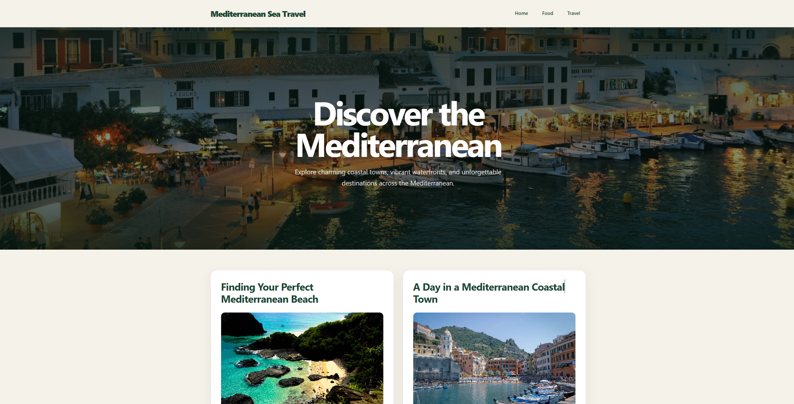

# Mediterranean Stories Travel Blog

🔗 **Live demo:** [Mediterranean Stories Travel Blog](https://mediterranean-stories-travel-blog.vercel.app/)

Mediterranean Stories is a responsive travel blog about the places, food and culture of the Mediterranean. Visitors can browse featured articles, read individual posts and explore curated resources.

The website is built with React, and its pages, navigation and editorial content are managed in Prismic. This project gave me practice working with a headless CMS, fetching API data and building client-side routes.

&nbsp;

---

## 🚀 Main Features

- Homepage content managed with Prismic slices
- Blog post listing with featured images
- Individual article pages loaded by their Prismic UID
- CMS-managed navigation and resource links
- Internal navigation between the homepage and articles
- Responsive layouts for desktop and mobile screens

&nbsp;

---

## 💡 Technologies


&nbsp;

---

## 🔗 See also

Are you interested in **JavaScript and Frontend Development**?
See my other projects on my GitHub profile [here](https://github.com/satoshi300).

&nbsp;

---

## 💿 Installation

The application is built with **React** and **JavaScript**, with content managed in **Prismic**. **Node.js** and **npm** are only required to install dependencies and run the development and build scripts.

1. Clone or download the repository

```bash
git clone https://github.com/satoshi300/Mediterranean-Stories-Travel-Blog.git
cd Mediterranean-Stories-Travel-Blog
```

2. Install dependencies:

```bash
npm install
```

3. Start the development server:

```bash
npm run start
```

4. Open [http://localhost:3000](http://localhost:3000) in your browser.

The application uses the Prismic repository configured in `src/prismic.js`. Published homepage, navigation and blog post content is required for the website to display its content.

To create a production build, run:

```bash
npm run build
```

&nbsp;

---

## 🤔 Solutions provided in the project

### 1. Fetching blog posts from Prismic

The blog listing loads all documents of the `blog_post` type from the CMS.

```javascript
client.getAllByType("blog_post")
	.then((resp) => {
		setPosts(resp);
	})
	.catch((err) => {
		console.error(err);
		setError("Failed to load blog posts.");
	})
	.finally(() => {
		setLoading(false);
	});
```

### 2. Loading an individual post by its UID

The post route provides a UID, which is used to request and render the matching Prismic document.

```javascript
const { uid } = useParams();

client.getByUID("blog_post", uid)
	.then((post) => setPost(post));
```

### 3. Navigating between application pages

React Router maps the homepage and individual blog posts to separate routes. The application uses `HashRouter`, so routes appear after a `#` in the browser URL.

```javascript
<Routes>
	<Route path="/" Component={Page} />
	<Route path="/blog/:uid" Component={BlogPost} />
</Routes>
```

### 4. Connecting Prismic document links to app routes

Links to blog documents use the application's `/blog/:uid` route. Other link types are rendered with Prismic's link component.

```javascript
<Link to={`/blog/${link.add_link.uid}`}>
	{link.add_link.text}
</Link>
```

### 5. Issue | Solution

| Issue | Solution |
| --- | --- |
| Keeping page content easy to update | Managed editorial content in Prismic |
| Loading the correct article | Queried blog posts by their UID |
| Navigating to CMS-linked articles | Connected document links to React Router routes |
| Supporting different screen sizes | Used responsive CSS layouts |

&nbsp;

---

## 💭 Conclusions for future projects

This project helped me practice building a React website around content from a headless CMS. I learned how to fetch Prismic documents, render rich text and images, and connect CMS document links to client-side routes.

In future projects I would like to improve:

- improving loading and error states across all pages
- adding article categories and pagination
- adding automated tests for routes and CMS content

&nbsp;

---

## 🙋‍♂️ Feel free to contact me

If you like the project or have suggestions, feel free to reach out via [GitHub](https://github.com/satoshi300) or [LinkedIn](https://www.linkedin.com/in/michal-wasiak-457a5331/).

&nbsp;

---

## 👏 Thanks / Special thanks / Credits

Thanks to my [Mentor - devmentor.pl](https://devmentor.pl/) for providing this project brief and code review.
